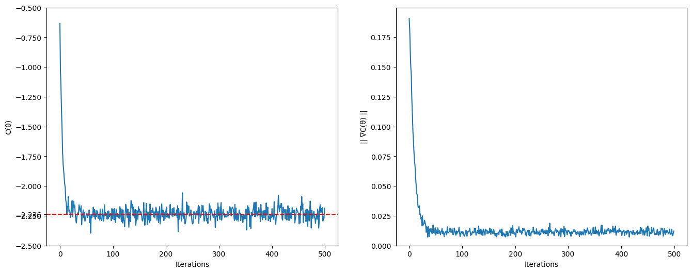

## Input
```python3
H = SparsePauliOp(["XX", "YY", "IZ"])

options = {
    "estimator": estimator,
    "pm": pm,
    "n_qubits": 2,
    "n_layers": 4,
    "linear": False,
    "observables": [H],
    "learning_rate": 0.5, # eta used in grad descent
    "steps": 500,         # no of overall iterations of VQA
    # https://docs.quantum.ibm.com/api/qiskit-ibm-runtime/qiskit_ibm_runtime.options.EstimatorOptions#default_shots
    "shots": 512,         # no of shots used by estimator, default = 4096
    "alpha": np.pi / 2,
    "seed": 40,
    "vals": None,         # uninitialized/random parameters
}
```

## Output
```
Iterations: 500
Total cost evaluations: 768000
Circuit depth: 4
δE₀ (error) = 1.2294339763249984 %
ΔE₀ (spread) = 0.1395321430811675 %
No. of iters to converge = 11
Fidelity: |⟨ψ_G|ψ_VQE⟩|² = 0.9999668118851879
```
